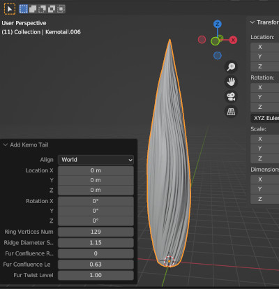
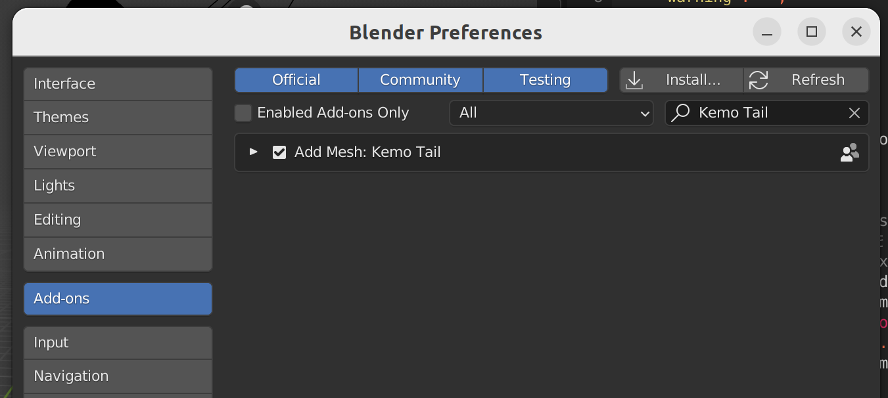

LisaKemoTail for Blender Addon
====  

# これは何？  
3Dモデルでケモノ尻尾を作成するBlenderアドオンです。  
（シンプルな狐風の尻尾を生成します。）  

  
  
]

# Install  
1. 本アドオンのZIPファイルを[Download](releases/download/v1.0/LisaKemoTailForBlenderAddon.zip)  
2. menuのEdit>Preference から Add-ons を選択  
3. Installボタンでダウンロードしたファイルを選択  
4. アドオン一覧に登場した本アドオンにチェックを入れて有効化  
  

# Usage  
1. In ObjectMode (switch mode Tab Key)  
2. Open Add menu (open Shift-A Key)  
3. Select Mesh>Kemo Tail  
  

# License  
Public Domain  

# Contact  
[Michinari.Nukazawa (twitter)][twitter]    
[michinari.nukazawa@gmail.com][mailto]  

[ghpages_index_SigNaGhostScripter]: http://michinarinukazawa.github.io/SigNaGhostScripterFont/html/
[blog_article]: http://blog.michinari-nukazawa.com/
[twitter]: http://blog.michinari-nukazawa.com/
[mailto]: mailto:michinari.nukazawa@gmail.com
[daisy_bell_pixiv_booth]: https://daisy-bell.booth.pm/
[daisy_bell_sourceforge]: https://sourceforge.jp/projects/daisybell-fonts/releases/

